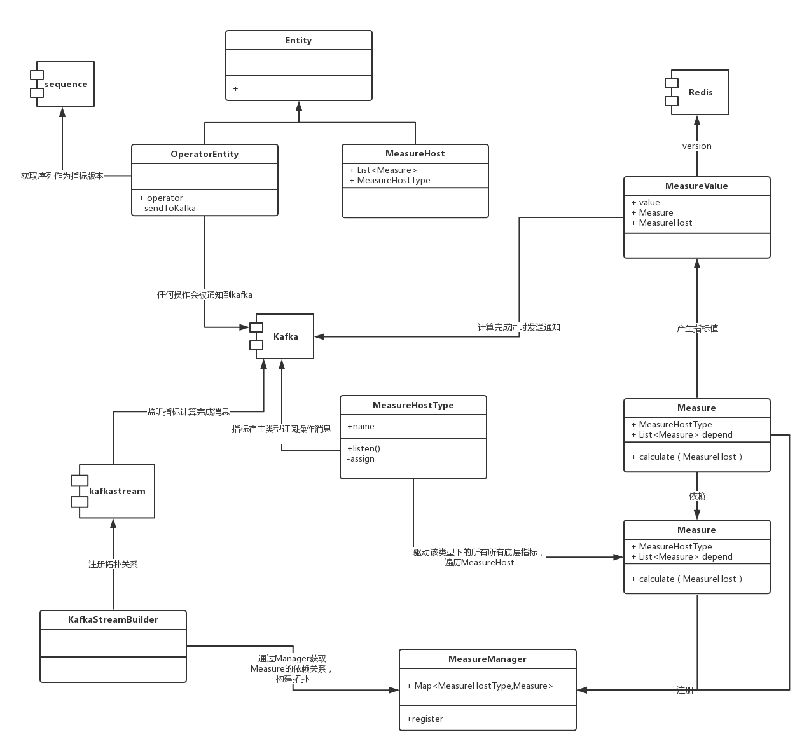

# 新架构原型介绍

## 系统架构

* 以微服务架构为指导原则，将系统拆分成一系列组件。
* 组件之间以同步调用为主，使用 http+HAL(json) 进行接口交互。
* 一部分异步操作，通过Kafka进行交互。目前需要异步推送的地方主要有：
  * 前台行情显示
  * 委托的队列处理
  * 指标的前台推送显示（已实现）
* 指标计算基于 Kafka Streams 框架进行分布式流式计算。
* 前台跟后台间通过web gateway进行隔离，前台请求应答模式通过http+HAL，推送的部分使用websocket。
* 支持 i18n。

### 使用的技术

#### 流程管理

* 版本管理：github，未来会替换成gitlab
* issue管理：github issue，未来会替换成gitlab issue
* 持续集成：jenkins

#### 基础设施

* 数据库： mariadb
* 缓存： redis
* 异步处理/消息队列：kafka
* 容器： docker + docker registry
* 容器编排：docker-compose，未来会替换为kubernetes或docker swarm

#### 后台

* 主用框架： Spring Boot + Spring Cloud
* 交互协议：http REST
* 报文格式：HAL (json)
* 日志：slf4j on logback with logstash's JSON encoder
* 服务发现：Eureka
* 流式计算：Kafka Streams
* 网关：Zuul
* 依赖包管理：gradle + maven registry

#### 前台
* 主用框架：vuejs
  * vue-router
  * vue-i18n
  * vuex
* 组件管理：webpack
* 样式、组件库：elementUI
* 交互协议：
  * 请求应答：http REST
  * 消息推送：websocket

### 同步调用示意

```mermaid
sequenceDiagram
	web frontend ->> web gateway: /fund-service/{fundId}/external-capital-accounts
	web gateway ->> fund service: /{fundId}/external-capital-accounts
	fund service ->> inventory service: /eca-cash-pools
	inventory service -->> fund service: [资金池列表]
	fund service -->> web gateway: [外部资金账户(包含资金池)]
	web gateway -->> web frontend: [外部资金账户(包含资金池)]
```

### 指令的异步处理

为了降低指令提交时事务处理的复杂性，我们将指令设计成带状态的。通过异步队列来实现指令的处理

```mermaid
sequenceDiagram
	frontend ->> invest service: 指令提交
	invest service ->> trade service: 指令分发
	trade service ->> queue: 资源申请
	queue -->> trade service: 资源申请已接受
	Note over queue, inventory service: 队列处理
	queue ->> inventory service: 处理资源申请
	inventory service -->> trade service: 资源申请处理完成
	trade service -->> invest service: 指令分发完成
	invest service -->> frontend: 指令提交完成
```

### 指标

指标是系统中由于业务发生而产生变化的数值。指标的数据由业务发生作为初始驱动，根据指标间依赖关系逐层计算。指标数据主要应用在风控、报表中。在业务逻辑中也会使用部分指标进行判断和处理。

下图是系统中设计的部分指标：

### 指标计算模型

指标基本上是一个树形结构。各个指标在不同层级之间相互依赖。但其依赖路径是确定的。然后由业务发生进行触发。

```mermaid
graph BT;
	A((总资产))
	B((现金))
	C((持仓市值))
	E[转帐流水]
	F[成交流水]
	F-->C
	F-->B
	E-->B
	C-->A
	B-->A
	
```

因为依赖路径是确定的，我们可以在系统中事先建立如上的拓扑图，然后当流水发生变化时，逐层触发计算。这种计算模式符合流式计算的特点。我们选用了 Kafka Streams 流计算框架作为我们的基础框架。自己实现了一套指标计算框架，可以比较方便的完成拓扑图的建立及运行。

#### 指标计算框架

## 开发环境建设

### 持续集成

我们设计通过持续集成来进行快速的开发与部署。

